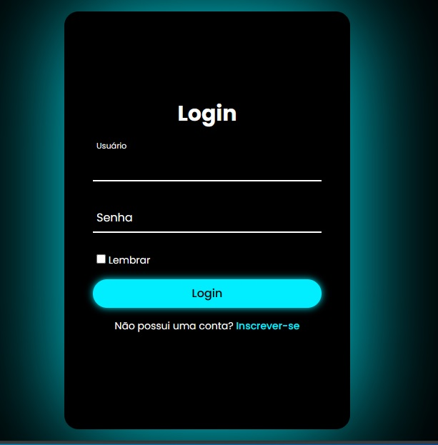
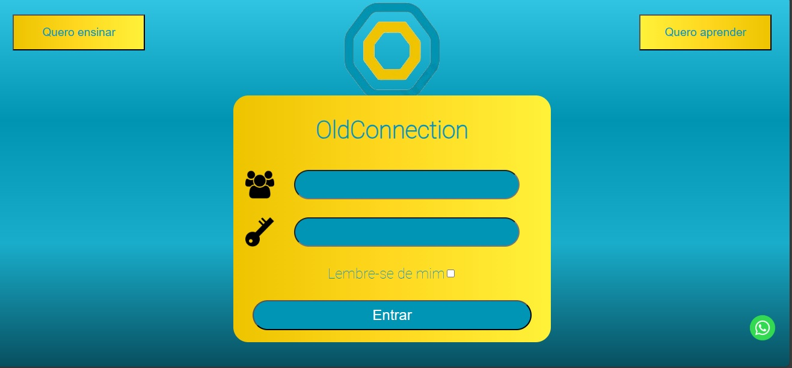
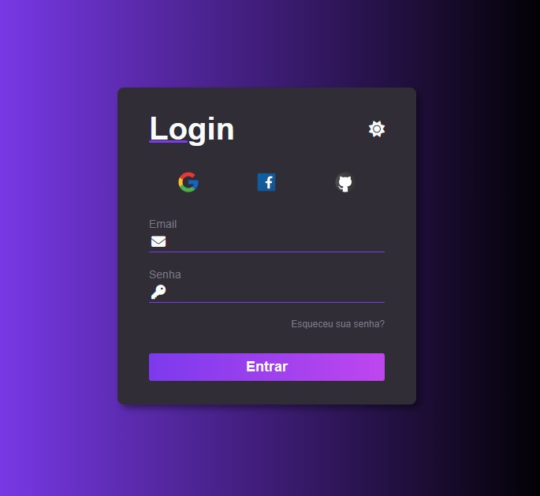

### Projeto: 001

### Projeto: 002

### Projeto: 003

Tela de login implementada com flex box, utlização de variáveis css e um modo de tema dark e light.
Possui exemplo de utilização de FontAwesome e chamada da font Poppins do Google Fonts.